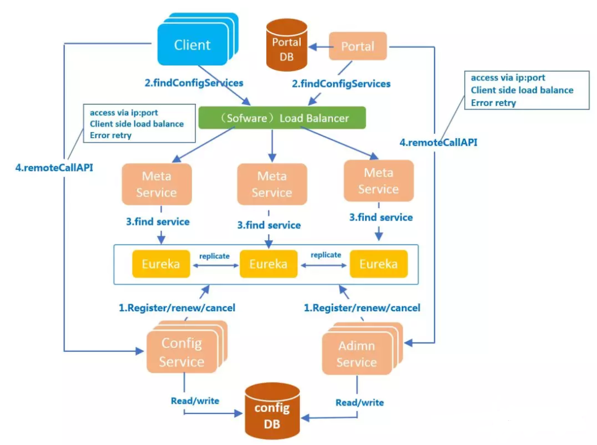

# Apollo学习笔记

## 前言

```properties
apollo=1.6.2
```

相关链接：

* Apollo Github 地址：https://github.com/ctripcorp/apollo
* Apollo 下载地址：https://github.com/ctripcorp/apollo/releases
* Java 项目配置 Apollo 指南：https://github.com/ctripcorp/apollo/wiki/Java%E5%AE%A2%E6%88%B7%E7%AB%AF%E4%BD%BF%E7%94%A8%E6%8C%87%E5%8D%97
* Apollo maven 地址：

## 配置文件

配置多种加载方式：内部硬编码、配置文件、环境变量、启动参数、基于数据库；

配置需要治理：

1. 权限控制：
2. 不同环境、集群配置管理：

## Apollo 工作原理

### 基础模型

1. 用户在配置中心对配置进行修改并发布
2. 配置中心通知Apollo客户端有配置更新
3. Apollo客户端从配置中心拉取最新的配置、更新本地配置并通知到应用

### 架构模块



#### 四个核心模块及其主要功能

1. **ConfigService** ：
   * 提供配置获取接口；
   * 提供配置推送接口；
   * 服务于 Apollo 客户端
2. **AdminService** ：
   * 提供配置管理接口；
   * 提供配置修改发布接口；
   * 服务于管理界面 Portal
3. **Client** ：
   * 为应用获取配置，支持实时更新；
   * 通过 MetaServer 获取 ConfigService 的服务列表；
   * 使用客户端软负载 SLB 方式调用 ConfigService
4. **Portal** ：
   * 配置管理界面；
   * 通过 MetaServer 获取 AdminService 的服务列表；
   * 使用客户端软负载 SLB 方式调用 AdminService

#### 三个辅助服务发现模块

1. **Eureka**：

   * 用于服务发现和注册；
   * Config/AdminService 注册实例并定期报心跳；
   * 和 ConfigService 住在一起部署

2. **MetaServer** ：

   * Portal 通过域名访问 MetaServer 获取 AdminService 的地址列表；
   * Client 通过域名访问 MetaServer 获取 ConfigService 的地址列表；
   * 相当于一个Eureka Proxy；
   * 逻辑角色，和ConfigService住在一起部署；

3. **NginxLB**

4. - 和域名系统配合，协助 Portal 访问 MetaServer 获取 AdminService 地址列表
   - 和域名系统配合，协助 Client 访问 MetaServer 获取 ConfigService 地址列表
   - 和域名系统配合，协助用户访问 Portal 进行配置管理

### 服务端设计

在配置中心中，一个重要的功能就是配置发布后实时推送到客户端。

1. 用户在Portal操作配置发布
2. Portal调用Admin Service的接口操作发布
3. Admin Service发布配置后，发送ReleaseMessage给各个Config Service
4. Config Service收到ReleaseMessage后，通知对应的客户端

### 客户端设计

1. 客户端和服务端保持了一个长连接，从而能第一时间获得配置更新的推送。（通过Http Long Polling实现）
2. 客户端还会定时从 Apollo 配置中心服务端拉取应用的最新配置。
   - 这是一个 fallback 机制，为了防止推送机制失效导致配置不更新
   - 客户端定时拉取会上报本地版本，所以一般情况下，对于定时拉取的操作，服务端都会返回304 - Not Modified
   - 定时频率默认为每5分钟拉取一次，客户端也可以通过在运行时指定System Property: `apollo.refreshInterval`来覆盖，单位为分钟。
3. 客户端从 Apollo 配置中心服务端获取到应用的最新配置后，会保存在内存中
4. 客户端会把从服务端获取到的配置在本地文件系统缓存一份
   - 在遇到服务不可用，或网络不通的时候，依然能从本地恢复配置
5. 应用程序可以从 Apollo 客户端获取最新的配置、订阅配置更新通知

## Apollo 特性

* 统一管理不同环境、不同集群的配置
* 配置修改实时生效（热发布）
* 版本发布管理
* 灰度发布
* 权限管理、发布审核、操作审计
* 客户端配置信息监控
* 提供开放平台API
* 部署简单：目前唯一的外部依赖是MySQL，所以部署非常简单，只要安装好Java和MySQL就可以让Apollo跑起来

## Apollo系统基础使用

### 创建部门

管理员工具 ——> 系统参数 ——> 搜索 key—— `organizations` ，按照原有的 JSON 格式即可创建；

### 创建用户

管理员工具 ——> 用户管理

## 快速入门

### maven 核心依赖

```xml
<dependency>
    <groupId>com.ctrip.framework.apollo</groupId>
    <artifactId>apollo-client</artifactId>
    <version>1.6.2</version>
</dependency>
```

### 简单入门

```java
package top.simba1949;

import com.ctrip.framework.apollo.Config;
import com.ctrip.framework.apollo.ConfigService;

/**
 * @author Anthony
 * @date 2020/7/24 16:22
 */
public class Application {
    /**
     * 需要在环境参数配置或者配置文件配置
     * 环境参数配置：
     * 需要在 VM Options 指定app.id 、evn、dev_meta地址
     * -Dapp.id=app-learn -Denv=DEV -Ddev_meta=http://192.168.8.12:8080
     *
     * 配置文件配置：
     *
     * @param args
     */
    public static void main(String[] args) {
        while (true){
            try {
                Thread.sleep(5000L);
            } catch (InterruptedException e) {
                e.printStackTrace();
            }

            Config config = ConfigService.getAppConfig();
            Boolean smsEnable = config.getBooleanProperty("sms.enable", null);
            System.out.println("smsEnable is " + smsEnable);
        }
    }
}
```

## 与 SpringBoot 集成

集群不推荐使用配置文件，推荐使用 VM Options

### maven 核心依赖

```xml
<dependency>
    <groupId>com.ctrip.framework.apollo</groupId>
    <artifactId>apollo-client</artifactId>
    <version>1.6.2</version>
</dependency>
```

### application.properties配置

```properties
server.port=8082
# 指定 appid
app.id = apollo-integrated-spring-boot
# 集成 spring-boot 开启 apollo
apollo.bootstrap.enable = true
# 指定 namespace （多个使用英文逗号分隔）
apollo.boootstrap.namespaces = application
```

### apollo-env.properties 配置

```properties
# 指定 mete-server
uat.meta = http://192.168.8.10:8080
fat.meta = http://192.168.8.11:8080
pro.meta = http://192.168.8.12:8080
```

### 测试代码

```java
package top.simba1949.controller;

import org.springframework.beans.factory.annotation.Value;
import org.springframework.web.bind.annotation.GetMapping;
import org.springframework.web.bind.annotation.RequestMapping;
import org.springframework.web.bind.annotation.RestController;

/**
 * @author Anthony
 * @date 2020/7/25 15:27
 */
@RestController
@RequestMapping("test")
public class TestController {

    @Value("${sms.enable}")
    private Boolean smsEnable;

    @GetMapping("sms")
    public Boolean getSmsEnableStr(){
        return smsEnable;
    }

    @GetMapping("value")
    public String getValueByKey(@Value("${test.key}")String value){
        System.out.println("value is " + value);
        return value;
    }
}
```

### 启动类

```java
package top.simba1949;

import com.ctrip.framework.apollo.spring.annotation.EnableApolloConfig;
import org.springframework.boot.SpringApplication;
import org.springframework.boot.autoconfigure.SpringBootApplication;

/**
 * @EnableApolloConfig ： 开启 apollo
 * @author Anthony
 * @date 2020/7/25 15:10
 */
@EnableApolloConfig
@SpringBootApplication
public class Application {
    public static void main(String[] args) {
        SpringApplication.run(Application.class, args);
    }
}
```

### 运行 VM Options 选项：用于指定环境

```shell
-Denv=dev
```

